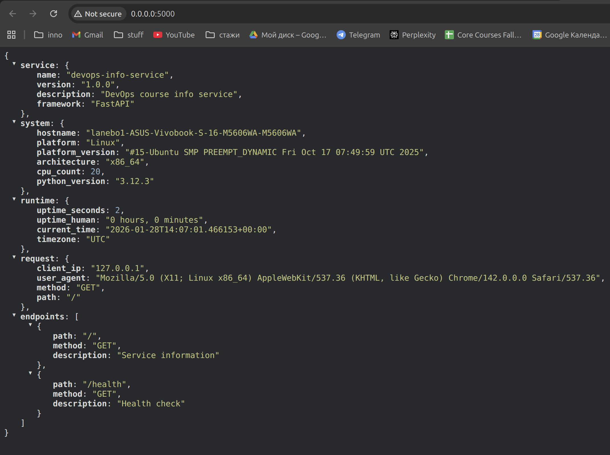
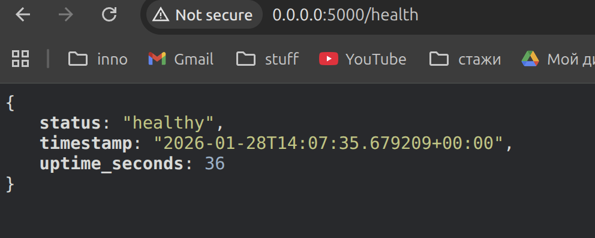
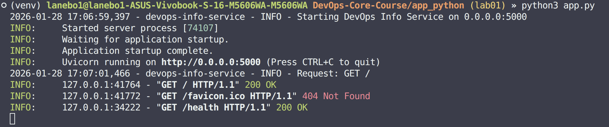

# LAB01 — DevOps Info Service (FastAPI)

## Framework Selection

I chose **FastAPI** (because I've worked with it previously)

| Framework | Pros                                      | Cons                            |
| --------- | ----------------------------------------- | ------------------------------- |
| FastAPI   | Async-ready, auto docs, great performance | Slightly more setup than Flask  |
| Flask     | Very lightweight, simple to learn         | No built-in async or docs and also old       |

## Best Practices Applied

- **Error handling**: custom handlers for 404 and 500 with JSON responses.
- **Logging**: structured logging for requests and startup.

## API Documentation

### `GET /`

**Example request:**

```bash
curl -s http://127.0.0.1:5000/ | python3 -m json.tool
```

**Example response (shape):**

```json
{
  "service": { "name": "devops-info-service", "framework": "FastAPI" },
  "system": { "hostname": "...", "platform": "..." },
  "runtime": { "uptime_seconds": 123, "timezone": "UTC" },
  "request": { "client_ip": "127.0.0.1", "method": "GET" },
  "endpoints": [
    { "path": "/", "method": "GET" },
    { "path": "/health", "method": "GET" }
  ]
}
```

### `GET /health`

**Example request:**

```bash
curl -s http://127.0.0.1:5000/health | python3 -m json.tool
```

**Example response:**

```json
{
  "status": "healthy",
  "timestamp": "2026-01-28T12:00:00+00:00",
  "uptime_seconds": 123
}
```

## Testing Evidence

- Screenshots to add in `app_python/docs/screenshots/`:
  - 
  - 
- Terminal output:
  - 

## GitHub Community

Starring repositories is a way to bookmark useful projects and send appreciation to maintainers. Following developers helps you discover relevant work and makes collaboration and professional networking easier over time.
