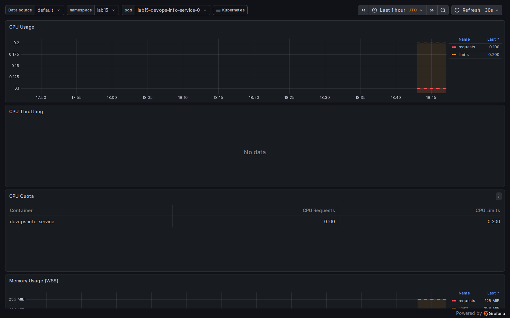
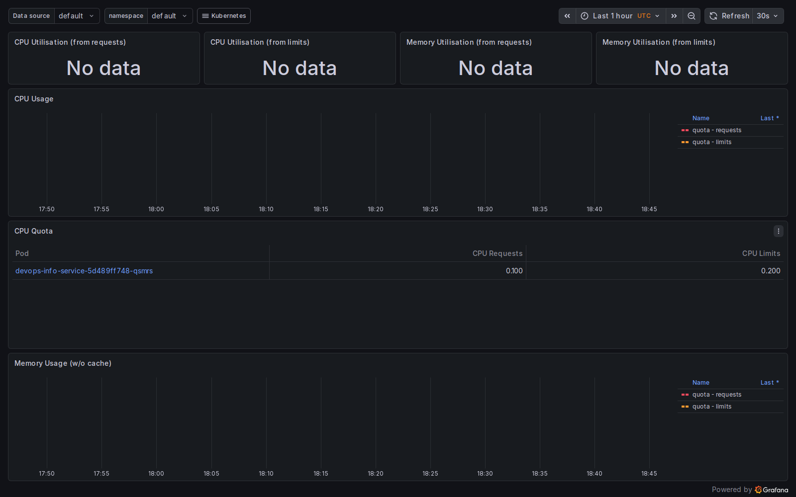
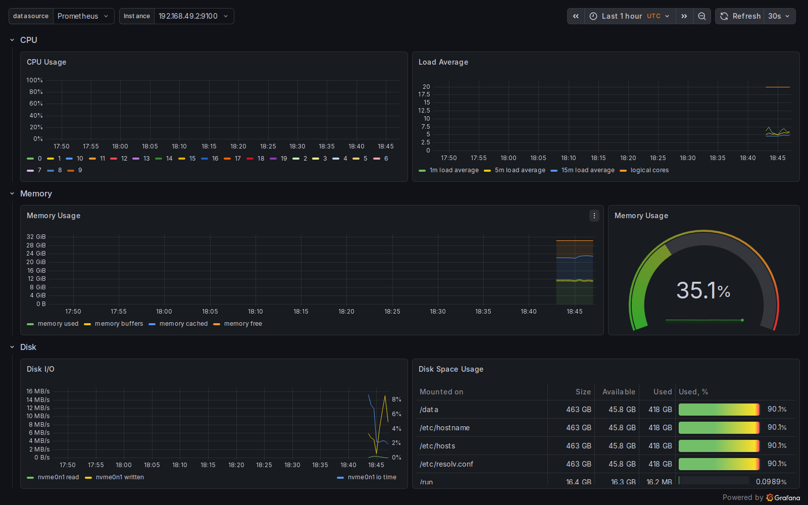
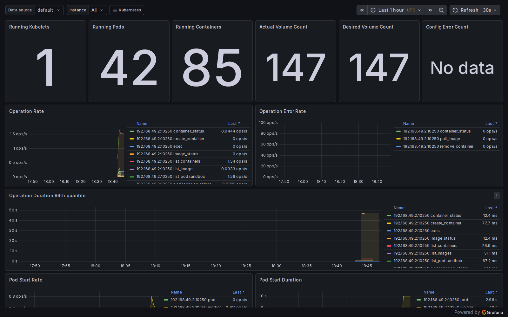
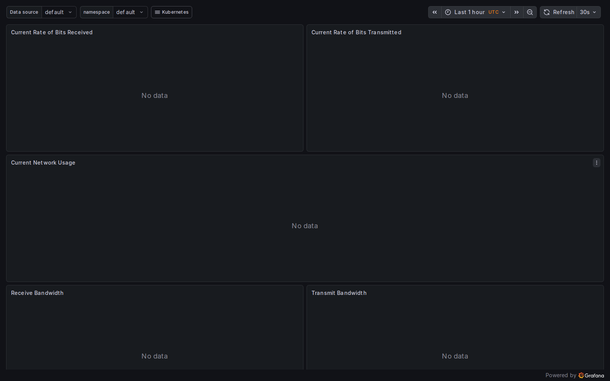
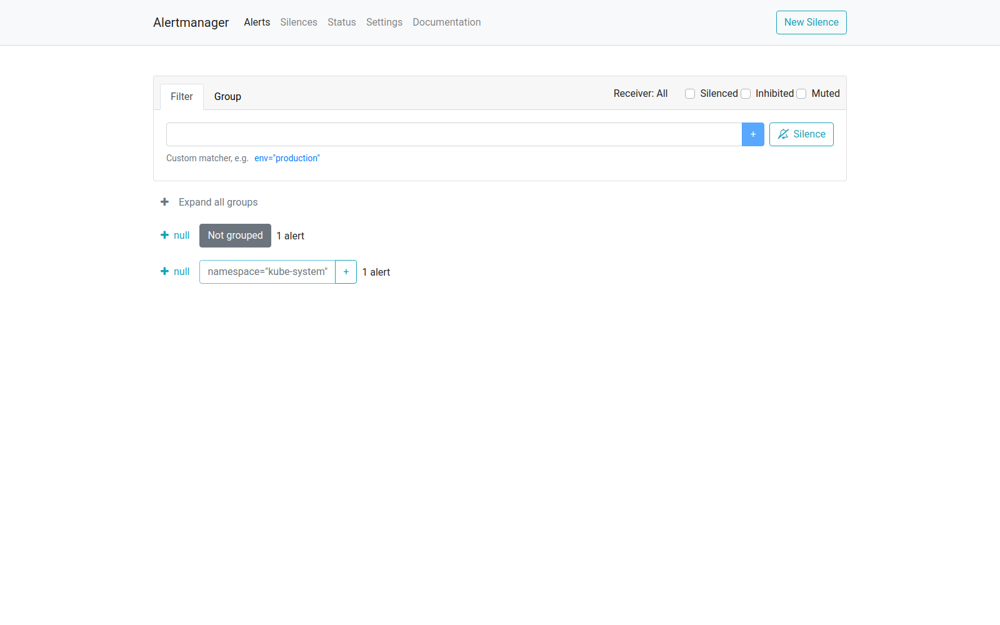

# Lab 16 — Kubernetes Monitoring & Init Containers

---

## 1. Stack components


| Component               | Role                                                                                                                                                                                                                                                  |
| ----------------------- | ----------------------------------------------------------------------------------------------------------------------------------------------------------------------------------------------------------------------------------------------------- |
| **Prometheus Operator** | Watches `Prometheus`, `ServiceMonitor`, `PodMonitor`, `Alertmanager`, and `PrometheusRule` CRDs. It materializes StatefulSets, configs, and scrape wiring so you manage monitoring declaratively instead of hand-editing Prometheus YAML on the node. |
| **Prometheus**          | Time-series database and scraper: pulls metrics from Kubernetes targets (kubelet/cAdvisor, `kube-state-metrics`, `node-exporter`, etc.), evaluates recording/alerting rules, and exposes PromQL + the HTTP API/UI.                                    |
| **Alertmanager**        | Receives alerts from Prometheus, deduplicates, groups, routes, and silences them; integrates with receivers (email, Slack, PagerDuty, “null” in dev).                                                                                                 |
| **Grafana**             | Visualization layer: reads Prometheus as a datasource and ships curated Kubernetes dashboards (CPU/memory by namespace/pod, nodes, kubelet, networking, etc.).                                                                                        |
| **kube-state-metrics**  | Exposes **Kubernetes object state** as metrics (Deployments, Pods, PVCs, etc.) so Prometheus can alert/query on desired vs actual state, not only container resource usage.                                                                           |
| **node-exporter**       | DaemonSet that exposes **host/node** hardware and OS metrics (CPU, memory, disk, network stack stats) for the node’s Linux kernel view.                                                                                                               |


---

## 2. Installation

### 2.1 Helm repository

```text
$ helm repo add prometheus-community https://prometheus-community.github.io/helm-charts
"prometheus-community" already exists with the same configuration, skipping

$ helm repo update
Hang tight while we grab the latest from your chart repositories...
...Successfully got an update from the "prometheus-community" chart repository
Update Complete. ⎈Happy Helming!⎈
```

### 2.2 Install / reconcile release in `monitoring`

The lab’s baseline install is:

```bash
helm install monitoring prometheus-community/kube-prometheus-stack \
  --namespace monitoring \
  --create-namespace
```

In this environment the first `helm install ... --wait` hit a timeout while large images were still pulling; the release was later reconciled to **healthy** with:

```bash
helm upgrade monitoring prometheus-community/kube-prometheus-stack \
  -n monitoring --reuse-values --wait --timeout 10m
```

Helm status after reconciliation:

```text
$ helm list -n monitoring
NAME      	NAMESPACE 	REVISION	UPDATED                                	STATUS  	CHART                       	APP VERSION
monitoring	monitoring	2       	2026-05-12 21:42:29 +0300 MSK	deployed	kube-prometheus-stack-85.0.1	v0.90.1

$ helm history monitoring -n monitoring --max 5
REVISION	UPDATED                 	STATUS    	CHART                       	APP VERSION	DESCRIPTION
1       	Tue May 12 20:46:43 2026	superseded	kube-prometheus-stack-85.0.1	v0.90.1    	Release "monitoring" failed: context deadline exceeded
2       	Tue May 12 21:42:29 2026	deployed  	kube-prometheus-stack-85.0.1	v0.90.1    	Upgrade complete
```

### 2.3 `kubectl get pods,svc -n monitoring`

```text
$ kubectl get pods,svc -n monitoring
NAME                                                         READY   STATUS    RESTARTS   AGE
pod/alertmanager-monitoring-kube-prometheus-alertmanager-0   2/2     Running   0          58m
pod/monitoring-grafana-5dff56dfbb-zfvzk                      3/3     Running   0          6m58s
pod/monitoring-kube-prometheus-operator-65587f96f-jz8vn      1/1     Running   0          61m
pod/monitoring-kube-state-metrics-676c88cc4-x5gvw            1/1     Running   0          61m
pod/monitoring-prometheus-node-exporter-4fk7s                1/1     Running   0          61m
pod/prometheus-monitoring-kube-prometheus-prometheus-0       2/2     Running   0          17m

NAME                                              TYPE        CLUSTER-IP       EXTERNAL-IP   PORT(S)                      AGE
service/alertmanager-operated                     ClusterIP   None             <none>        9093/TCP,9094/TCP,9094/UDP   58m
service/monitoring-grafana                        ClusterIP   10.101.206.108   <none>        80/TCP                       61m
service/monitoring-kube-prometheus-alertmanager   ClusterIP   10.102.121.99    <none>        9093/TCP,8080/TCP            61m
service/monitoring-kube-prometheus-operator       ClusterIP   10.111.25.112    <none>        443/TCP                      61m
service/monitoring-kube-prometheus-prometheus     ClusterIP   10.105.188.115   <none>        9090/TCP,8080/TCP            61m
service/monitoring-kube-state-metrics             ClusterIP   10.104.56.252    <none>        8080/TCP                     61m
service/monitoring-prometheus-node-exporter       ClusterIP   10.100.192.9     <none>        9100/TCP                     61m
service/prometheus-operated                       ClusterIP   None             <none>        9090/TCP                     58m
```

**Access:**

```bash
kubectl port-forward svc/monitoring-grafana -n monitoring 3000:80
kubectl get secret monitoring-grafana -n monitoring -o jsonpath='{.data.admin-password}' | base64 -d ; echo
# user: admin  (password comes from the secret; it is not always literally "prom-operator" on newer chart defaults)
```

---

## 3. Grafana & Alertmanager exploration

Screenshots were captured after port-forwarding Grafana and Alertmanager locally. Files live under `k8s/screenshots/`.

| #   | Question                                        | Notes / measured values                                                                                                                                                                                                                                                                                                                                                                                                                                                                                                                                                   |
| --- | ----------------------------------------------- | ------------------------------------------------------------------------------------------------------------------------------------------------------------------------------------------------------------------------------------------------------------------------------------------------------------------------------------------------------------------------------------------------------------------------------------------------------------------------------------------------------------------------------------------------------------------------- |
| 1   | **StatefulSet pod resources (CPU/memory)**      | Dashboard: **Kubernetes / Compute Resources / Pod** with `namespace=lab15`, `pod=lab15-devops-info-service-0`. PromQL cross-check (5m rate): `sum by (pod) (rate(container_cpu_usage_seconds_total{namespace="lab15", pod=~"lab15-devops-info-service-.*"}[5m]))` ≈ **0.0051 cores/pod** (three pods nearly identical). Memory working set: `sum by (pod) (container_memory_working_set_bytes{namespace="lab15", pod=~"lab15-devops-info-service-.*"})` → **~38.8 / 45.2 / 51.1 MiB** for pods `-0`, `-1`, `-2` respectively (bytes: `40706048`, `47353856`, `53559296`). |
| 2   | **Which pods use most/least CPU in `default`?** | Dashboard: **Kubernetes / Compute Resources / Namespace (Pods)** (`namespace=default`). PromQL: `topk(10, sum by (pod) (rate(container_cpu_usage_seconds_total{namespace="default"}[5m])))` → highest **`devops-info-service-5d489ff748-qsmrs` (~0.00385 cores)**; next `lab16-backend-…`. `bottomk` shows **lowest CPU tied at ~0** for `lab16-init-download` and `lab16-wait-client` (idle sleep pods), then `lab16-backend`.                                                                                                                                           |
| 3   | **Node metrics — memory % / MiB, CPU cores**    | Dashboard: **Node Exporter / Nodes** (minikube node). From `node_memory_*` on the `node-exporter` job: **MemTotal ≈ 32 715 042 816 B (~31 120 MiB)**, **MemAvailable ≈ 20 739 330 048 B (~19 780 MiB)** → **~36.6 % memory in use** (not available). **CPU cores (logical) = 20** via `count without(cpu, mode) (node_cpu_seconds_total{job="node-exporter", mode="idle"})`.                                                                                                                                                                                              |
| 4   | **Kubelet — how many pods/containers managed?** | Dashboard: **Kubernetes / Kubelet**. PromQL snapshot on the minikube node: `sum(kubelet_running_pods{job="kubelet", node="minikube"})` → **42 pods**; `sum(kubelet_running_containers{job="kubelet", node="minikube"})` → **86 containers**.                                                                                                                                                                                                                                                                                                                              |
| 5   | **Network traffic for pods in `default`**       | Dashboard: **Kubernetes / Networking / Namespace (Pods)** (`namespace=default`). In this cluster scrape, `container_network_receive_bytes_total` did not return series for `default` over the Prometheus HTTP API at capture time; the Grafana dashboard still shows the intended **per-pod RX/TX** view for the namespace.                                                                                                                                                                                                                                               |
| 6   | **Alerts — how many active? Alertmanager UI**   | `GET /api/v2/alerts` on Alertmanager reported **2 active** alerts at capture time: **`Watchdog`** (intentionally always firing to prove the pipeline) and **`etcdInsufficientMembers`** for the `kube-etcd` ServiceMonitor target (common noisy alert in **minikube** because etcd is not exposed like a full HA cluster).                                                                                                                                                                                                                                                |

### Screenshots (same order as the table)

#### 1. StatefulSet pod resources (CPU / memory)



#### 2. Namespace `default` — which pods use most / least CPU



#### 3. Node metrics (memory, CPU cores)



#### 4. Kubelet — pods / containers



#### 5. Network — pods in `default`



#### 6. Alerts — Alertmanager UI




---

## 4. Init containers

### 4.1 Manifests

- `k8s/lab16-init-download.yaml` — `wget` downloads `https://example.com` into a shared `emptyDir`; the main container reads `/data/index.html`.
- `k8s/lab16-wait-for-service.yaml` — `Deployment` + `Service` `lab16-backend` (image `nginx:1.29.1`, `IfNotPresent` so Minikube’s cached base image is used) and `lab16-wait-client` whose init loop performs HTTP checks until the Service answers.

Apply order for the wait pattern: the file is written so you can `kubectl apply -f k8s/lab16-wait-for-service.yaml` as a whole; the init container loops until the backend is ready.

### 4.2 Verification 

```text
$ kubectl delete pod lab16-init-download --ignore-not-found
pod "lab16-init-download" deleted from default namespace

$ kubectl apply -f k8s/lab16-init-download.yaml
pod/lab16-init-download created

$ kubectl wait --for=condition=ready pod/lab16-init-download --timeout=120s
pod/lab16-init-download condition met

$ kubectl logs lab16-init-download -c init-download
Connecting to example.com (8.47.69.0:443)
wget: note: TLS certificate validation not implemented
saving to '/work-dir/index.html'
index.html           100% |********************************|   528  0:00:00 ETA
'/work-dir/index.html' saved

$ kubectl exec lab16-init-download -c main-app -- head -3 /data/index.html
<!doctype html><html lang="en"><head><title>Example Domain</title><meta name="viewport" content="width=device-width, initial-scale=1"><style>body{background:#eee;width:60vw;margin:15vh auto;font-family:system-ui,sans-serif}h1{font-size:1.5em}div{opacity:0.8}a:link,a:visited{color:#348}</style></head><body><div><h1>Example Domain</h1><p>This domain is for use in documentation examples without needing permission. Avoid use in operations.</p><p><a href="https://iana.org/domains/example">Learn more</a></p></div></body></html>

$ kubectl logs lab16-wait-client -c wait-for-service | tail -n 2
backend is reachable

$ kubectl logs lab16-wait-client -c main | tail -n 1
main started
```

---

