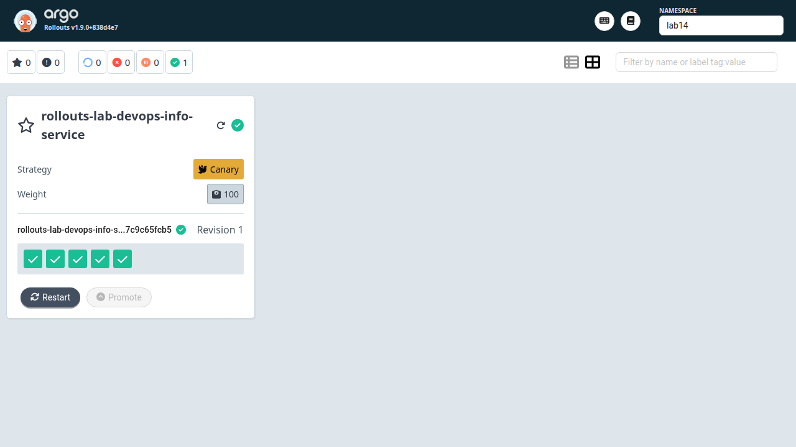
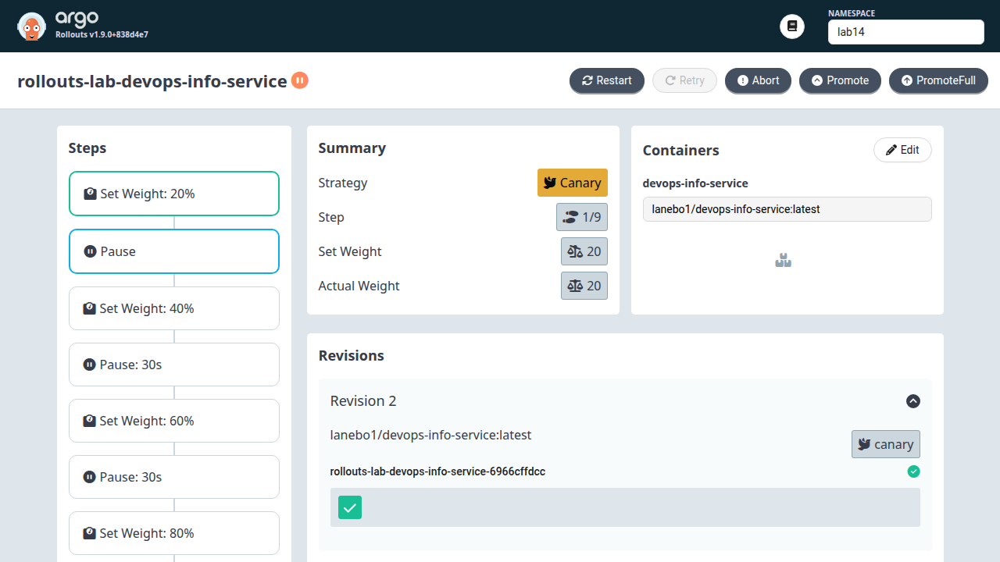
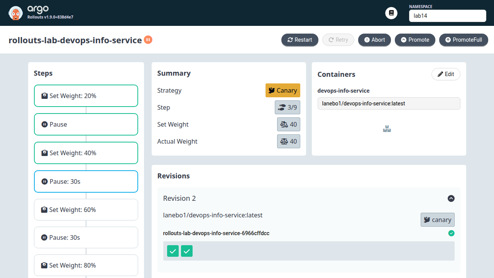
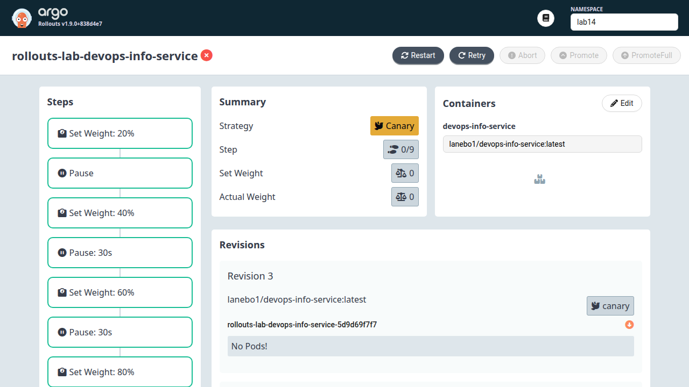
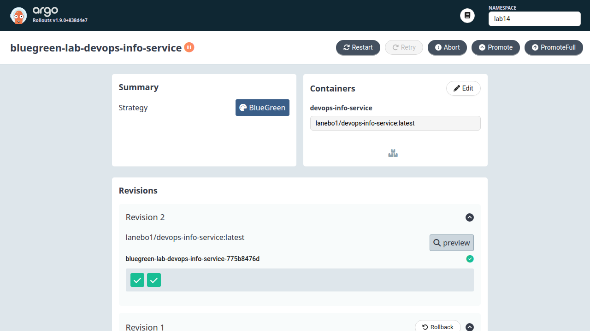
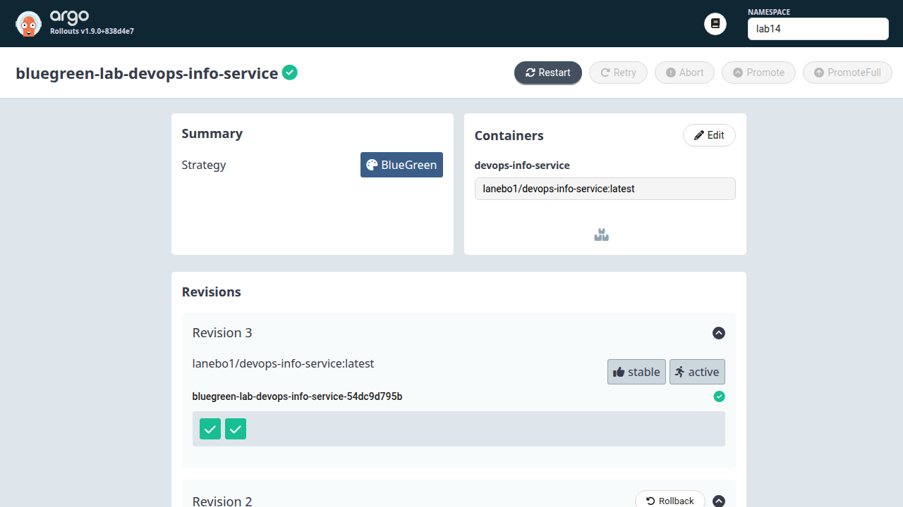

# Lab 14 - Argo Rollouts

## Argo Rollouts Setup

Controller and dashboard were installed into the `argo-rollouts` namespace:

```bash
kubectl create namespace argo-rollouts
kubectl apply -n argo-rollouts -f https://github.com/argoproj/argo-rollouts/releases/latest/download/install.yaml
kubectl apply -n argo-rollouts -f https://github.com/argoproj/argo-rollouts/releases/latest/download/dashboard-install.yaml
```

Verification:

```text
$ kubectl get crd rollouts.argoproj.io
NAME                   CREATED AT
rollouts.argoproj.io   2026-04-29T08:15:15Z

$ kubectl get deploy,pods,svc -n argo-rollouts -o wide
NAME                                      READY   UP-TO-DATE   AVAILABLE
deployment.apps/argo-rollouts             1/1     1            1
deployment.apps/argo-rollouts-dashboard   1/1     1            1

NAME                                           READY   STATUS
pod/argo-rollouts-5cf9b959f9-s6rvn             1/1     Running
pod/argo-rollouts-dashboard-7546666c98-qhtdj   1/1     Running

NAME                              TYPE        PORT(S)
service/argo-rollouts-dashboard   ClusterIP   3100/TCP
service/argo-rollouts-metrics     ClusterIP   8090/TCP
```

CLI plugin:

```text
$ kubectl argo rollouts version
kubectl-argo-rollouts: v1.9.0+838d4e7
BuildDate: 2026-03-20T21:08:11Z
Platform: linux/amd64
```

Dashboard access:

```bash
kubectl port-forward svc/argo-rollouts-dashboard -n argo-rollouts 3100:3100
```

URL used: `http://127.0.0.1:3100/rollouts/lab14`

## Rollout vs Deployment

A `Rollout` keeps the familiar Deployment shape: `replicas`, `selector`, and
`template` are still used for the workload. The difference is the strategy API:

```text
$ kubectl explain rollout.spec.strategy --api-version=argoproj.io/v1alpha1
GROUP:      argoproj.io
KIND:       Rollout
VERSION:    v1alpha1

FIELD: strategy <Object>

FIELDS:
  blueGreen  <Object>
  canary     <Object>
```

Key differences:

- Deployment supports native `RollingUpdate` and `Recreate`.
- Rollout supports `canary` and `blueGreen` strategies.
- Rollout can pause, promote, abort, undo, and keep stable/canary ReplicaSets.
- Rollout can mutate active/preview Service selectors for blue-green switches.

## Canary Deployment

Chart files:

- `templates/rollout.yaml` renders `apiVersion: argoproj.io/v1alpha1`, `kind: Rollout`.
- `templates/deployment.yaml` is disabled when `rollout.enabled=true`.
- `values.yaml` contains the canary strategy.

Canary steps:

```yaml
rollout:
  enabled: true
  strategy: canary
  canary:
    steps:
      - setWeight: 20
      - pause: {}
      - setWeight: 40
      - pause:
          duration: 30s
      - setWeight: 60
      - pause:
          duration: 30s
      - setWeight: 80
      - pause:
          duration: 30s
      - setWeight: 100
```

Deploy initial version:

```bash
kubectl create namespace lab14
helm upgrade --install rollouts-lab k8s/devops-info-service \
  --namespace lab14 \
  --set service.type=ClusterIP \
  --set service.nodePort=null \
  --set replicaCount=5 \
  --set rollout.strategy=canary \
  --set rollout.revision=canary-v1
```

Initial app test through the real Service:

```text
$ kubectl port-forward svc/rollouts-lab-devops-info-service -n lab14 8080:80
Forwarding from 127.0.0.1:8080 -> 5000

$ curl -sS http://127.0.0.1:8080/health
{"status":"healthy","timestamp":"2026-04-29T08:18:31.507015+00:00","uptime_seconds":19}
```

Dashboard healthy state:



Trigger revision 2:

```bash
helm upgrade rollouts-lab k8s/devops-info-service \
  --namespace lab14 \
  --set service.type=ClusterIP \
  --set service.nodePort=null \
  --set replicaCount=5 \
  --set rollout.strategy=canary \
  --set rollout.revision=canary-v2
```

Manual pause at 20%:

```text
Name:            rollouts-lab-devops-info-service
Namespace:       lab14
Status:          Paused
Message:         CanaryPauseStep
Strategy:        Canary
  Step:          1/9
  SetWeight:     20
  ActualWeight:  20
Replicas:
  Desired:       5
  Updated:       1
  Ready:         5
```



Manual promotion:

```text
$ kubectl argo rollouts promote rollouts-lab-devops-info-service -n lab14
rollout 'rollouts-lab-devops-info-service' promoted
```

The rollout then advanced through timed pauses. At 40%:

```text
Status:          Paused
Message:         CanaryPauseStep
Strategy:        Canary
  Step:          3/9
  SetWeight:     40
  ActualWeight:  40
Replicas:
  Desired:       5
  Updated:       2
  Ready:         5
```



Final canary state:

```text
Healthy
Status:          Healthy
Strategy:        Canary
  Step:          9/9
  SetWeight:     100
  ActualWeight:  100
Replicas:
  Desired:       5
  Updated:       5
  Ready:         5
```

Abort rollback test used revision 3:

```bash
helm upgrade rollouts-lab k8s/devops-info-service \
  --namespace lab14 \
  --set service.type=ClusterIP \
  --set service.nodePort=null \
  --set replicaCount=5 \
  --set rollout.strategy=canary \
  --set rollout.revision=canary-v3

kubectl argo rollouts abort rollouts-lab-devops-info-service -n lab14
```

Observed after abort:

```text
rollout 'rollouts-lab-devops-info-service' aborted
Status:          Degraded
Message:         RolloutAborted: Rollout aborted update to revision 3
Strategy:        Canary
  SetWeight:     0
  ActualWeight:  0
Replicas:
  Desired:       5
  Current:       5
  Updated:       0
  Ready:         5
  Available:     5

revision:3 ReplicaSet  ScaledDown  canary
revision:2 ReplicaSet  Healthy     stable
```



After capturing the abort evidence, the canary rollout was restored to the
healthy stable template:

```text
$ kubectl argo rollouts undo rollouts-lab-devops-info-service -n lab14 --to-revision=2
rollout 'rollouts-lab-devops-info-service' undo
Healthy
Status:          Healthy
Strategy:        Canary
  Step:          9/9
  SetWeight:     100
  ActualWeight:  100
```

## Blue-Green Deployment

Blue-green is configured with `values-bluegreen.yaml`:

```yaml
rollout:
  enabled: true
  strategy: blueGreen
  blueGreen:
    autoPromotionEnabled: false
    autoPromotionSeconds: null
```

The Rollout strategy renders:

```yaml
strategy:
  blueGreen:
    activeService: bluegreen-lab-devops-info-service
    previewService: bluegreen-lab-devops-info-service-preview
    autoPromotionEnabled: false
```

The chart also creates `templates/service-preview.yaml` for preview traffic.

Deploy blue version:

```bash
helm upgrade --install bluegreen-lab k8s/devops-info-service \
  --namespace lab14 \
  -f k8s/devops-info-service/values-bluegreen.yaml \
  --set service.type=ClusterIP \
  --set service.nodePort=null \
  --set replicaCount=2 \
  --set rollout.revision=blue-v1
```

Initial active and preview Services both pointed at the blue ReplicaSet:

```text
service/bluegreen-lab-devops-info-service           selector rollouts-pod-template-hash=54dc9d795b
service/bluegreen-lab-devops-info-service-preview   selector rollouts-pod-template-hash=54dc9d795b
```

Trigger green version:

```bash
helm upgrade bluegreen-lab k8s/devops-info-service \
  --namespace lab14 \
  -f k8s/devops-info-service/values-bluegreen.yaml \
  --set service.type=ClusterIP \
  --set service.nodePort=null \
  --set replicaCount=2 \
  --set rollout.revision=green-v2
```

Paused with active and preview split:

```text
Status:          Paused
Message:         BlueGreenPause
Strategy:        BlueGreen
Replicas:
  Desired:       2
  Current:       4
  Updated:       2
  Ready:         2

revision:2 ReplicaSet  Healthy  preview
revision:1 ReplicaSet  Healthy  stable,active

bluegreen-lab-devops-info-service selector={"rollouts-pod-template-hash":"54dc9d795b"}
bluegreen-lab-devops-info-service-preview selector={"rollouts-pod-template-hash":"775b8476d"}
```

Preview testing:

```text
$ curl http://127.0.0.1:8082/
active pod: bluegreen-lab-devops-info-service-54dc9d795b-6qn2n

$ curl http://127.0.0.1:8083/
preview pod: bluegreen-lab-devops-info-service-775b8476d-6q8bf
```



Promote green to active:

```text
$ kubectl argo rollouts promote bluegreen-lab-devops-info-service -n lab14
rollout 'bluegreen-lab-devops-info-service' promoted

Status:          Healthy
Strategy:        BlueGreen
revision:2 ReplicaSet  Healthy  stable,active

bluegreen-lab-devops-info-service selector={"rollouts-pod-template-hash":"775b8476d"}
bluegreen-lab-devops-info-service-preview selector={"rollouts-pod-template-hash":"775b8476d"}
```

After reconnecting the port-forward, active traffic reached green:

```text
active after promote: bluegreen-lab-devops-info-service-775b8476d-6q8bf
```

Rollback to blue:

```text
$ kubectl argo rollouts undo bluegreen-lab-devops-info-service -n lab14 --to-revision=1
rollout 'bluegreen-lab-devops-info-service' undo

Status:          Healthy
Strategy:        BlueGreen
revision:3 ReplicaSet  Healthy  stable,active

bluegreen-lab-devops-info-service selector={"rollouts-pod-template-hash":"54dc9d795b"}
```

After reconnecting the active port-forward:

```text
active after rollback: bluegreen-lab-devops-info-service-54dc9d795b-6qn2n
```



Blue-green rollback was effectively instant because the Service selector changed
back to the old ReplicaSet hash. Canary rollback involved scaling canary pods
down and stable pods back up according to the rollout controller.

## Strategy Comparison

Use canary when:

- risk should be reduced gradually;
- the service can tolerate mixed old/new versions;
- you want to observe behavior at 20/40/60/80/100% before full rollout.

Canary pros:

- gradual blast-radius control;
- supports manual and timed gates;
- can be integrated with metrics analysis later.

Canary cons:

- slower than blue-green;
- without a traffic manager, percentages map to pod counts and are approximate;
- mixed versions must be compatible.

Use blue-green when:

- the new version should be tested in a preview environment first;
- promotion and rollback need to be immediate;
- running both stacks temporarily is acceptable.

Blue-green pros:

- instant active traffic switch;
- preview Service allows validation before promotion;
- rollback is a Service selector switch.

Blue-green cons:

- needs enough capacity for both blue and green during rollout;
- all traffic moves at once after promotion;
- less gradual production exposure than canary.

Recommendation:

- Use canary for externally used APIs where gradual exposure is safer.
- Use blue-green for internal apps, UI releases, and changes that need a clean
  pre-production preview plus fast rollback.


