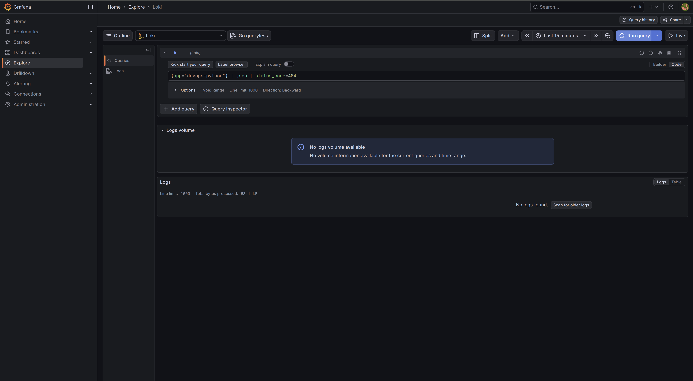
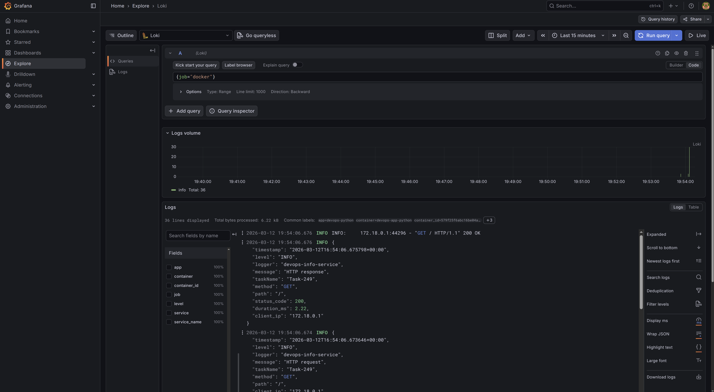
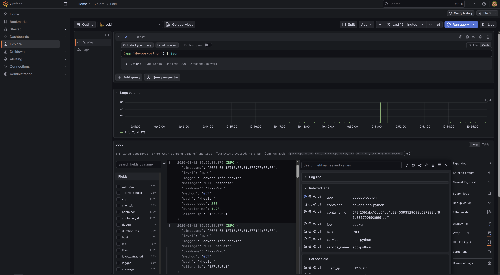
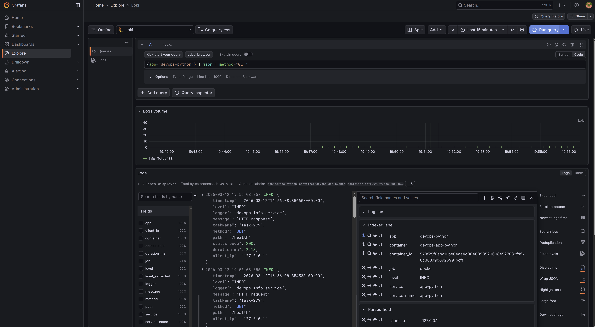
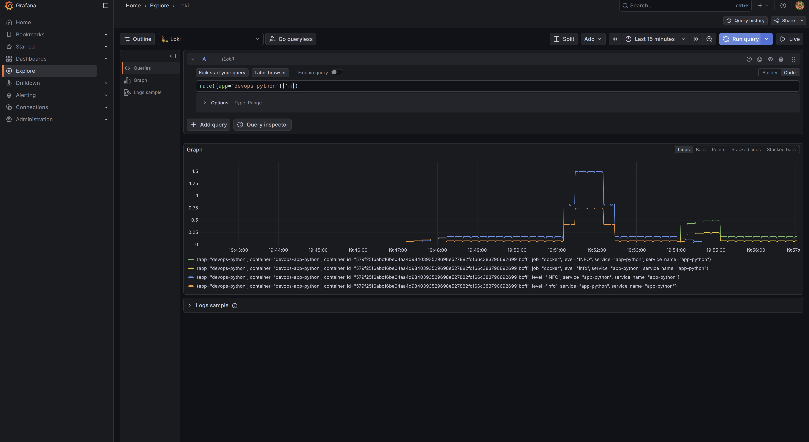
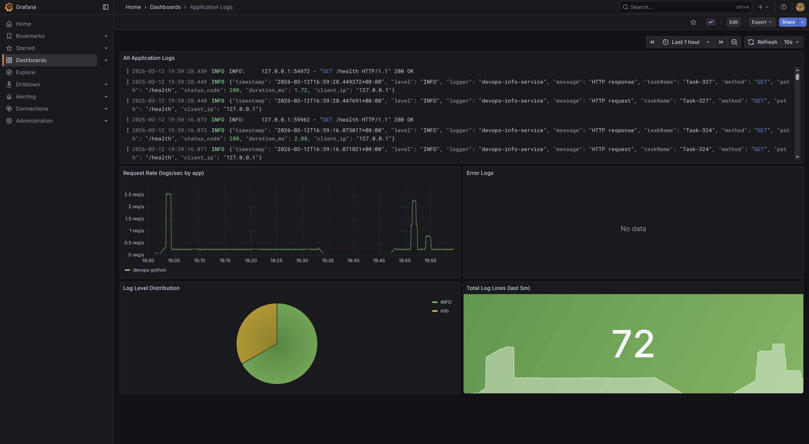

# Lab 07 — Observability & Logging with Loki Stack

## Architecture

```
┌─────────────────────────────────────────────────────────────────┐
│                        Docker network: logging                  │
│                                                                 │
│  ┌──────────────┐    ┌──────────────┐    ┌──────────────────┐   │
│  │  app-python  │    │   promtail   │───▶│      loki        │   │
│  │  :8000→5000  │    │    :9080     │    │      :3100       │   │
│  └──────┬───────┘    └──────────────┘    └────────┬─────────┘   │
│         │                 ↑ scrape                 │            │
│         │           docker logs                    │            │
│         └─────── generates logs ──────────────────▶│            │
│                                                     ▼           │
│                                          ┌──────────────────┐   │
│                                          │     grafana      │   │
│                                          │      :3000       │   │
│                                          └──────────────────┘   │
└─────────────────────────────────────────────────────────────────┘
```

**Flow:** app-python emits JSON logs → Docker captures them →
Promtail discovers containers via Docker socket → ships to Loki → Grafana queries Loki.

## Setup Guide

### Prerequisites

- Docker
- Docker Compose v2

### Deploy

```bash
cd monitoring
docker compose up -d --build

# Verify all services
docker compose ps
```

### Verify endpoints

```bash
# Loki readiness
curl http://localhost:3100/ready

# Promtail targets
curl http://localhost:9080/targets

# App health
curl http://localhost:8000/health

# Grafana UI
open http://localhost:3000   # admin / admin123
```

**Verify all services are running:**



## Configuration

### Loki (`loki/config.yml`)

Key choices:

| Setting | Value | Reason |
|---|---|---|
| `store: tsdb` | TSDB | Faster queries vs boltdb-shipper (Loki 3.0 recommended) |
| `schema: v13` | v13 | Required for TSDB on Loki 3.0+ |
| `object_store: filesystem` | filesystem | Single-instance local deployment |
| `retention_period: 168h` | 7 days | Reasonable retention for dev/staging |
| `auth_enabled: false` | false | Single-tenant setup |

TSDB (Time-Series Database) in Loki 3.0 offers up to 10× faster queries and lower memory usage compared to boltdb-shipper.

### Promtail (`promtail/config.yml`)

Uses Docker service discovery (`docker_sd_configs`) to automatically find containers. Only containers labelled `logging=promtail` are scraped (opt-in filtering).

Relabeling pipeline:
1. `__meta_docker_container_name` → `container` label (strips leading `/`)
2. `__meta_docker_container_label_app` → `app` label
3. `__meta_docker_container_id` → `container_id`
4. `__meta_docker_container_label_com_docker_compose_service` → `service`

A Promtail pipeline stage parses the JSON log body and promotes `level` as a stream label for efficient filtering.


## Application Logging

`app_python/app.py` uses a custom `JSONFormatter`:

```python
class JSONFormatter(logging.Formatter):
    def format(self, record: logging.LogRecord) -> str:
        log_obj = {
            "timestamp": datetime.fromtimestamp(record.created, tz=timezone.utc).isoformat(),
            "level": record.levelname,
            "logger": record.name,
            "message": record.getMessage(),
        }
        # ... extra fields from record.__dict__
        return json.dumps(log_obj, default=str)
```

An HTTP middleware logs every request and response:

```python
@app.middleware("http")
async def log_requests(request: Request, call_next):
    logger.info("HTTP request", extra={"method": ..., "path": ..., "client_ip": ...})
    response = await call_next(request)
    logger.info("HTTP response", extra={"status_code": ..., "duration_ms": ...})
    return response
```

Example output:

```json
{"timestamp": "2026-03-12T16:01:08.973889+00:00", "level": "INFO", "logger": "devops-info-service", "message": "HTTP response", "method": "GET", "path": "/", "status_code": 200, "duration_ms": 3.12, "client_ip": "172.18.0.1"}
```

## Dashboard

**Grafana login page (anonymous access disabled):**



**Logs in Grafana Explore (`{job="docker"}`):**



**JSON parsed logs with structured fields:**



**Application Logs dashboard (auto-provisioned):**



Provisioned automatically at startup via `grafana/provisioning/dashboards/app-logs.json`.

### Panel 1 — All Application Logs (Logs visualization)

```logql
{app=~"devops-.*"}
```

Shows raw log lines from all apps tagged with the `devops-` prefix. Used for real-time tailing.

### Panel 2 — Request Rate (Time series)

```logql
sum by (app) (rate({app=~"devops-.*"}[1m]))
```

Logs per second per application. Useful for spotting traffic spikes and comparing load across apps.

### Panel 3 — Error Logs (Logs visualization)

```logql
{app=~"devops-.*"} | json | level=`ERROR`
```

Filters only ERROR-level logs using the JSON parser. Direct visibility into failures.

### Panel 4 — Log Level Distribution (Pie chart)

```logql
sum by (level) (count_over_time({app=~"devops-.*"} | json [5m]))
```

Counts log entries by level over a 5-minute window. Good for understanding the noise ratio (INFO vs ERROR vs WARNING).

### Panel 5 — Total Log Lines (Stat)

```logql
sum(count_over_time({app=~"devops-.*"}[5m]))
```

A quick counter of total log volume in the last 5 minutes.

## Production Config

### Resource Limits

All services have `deploy.resources` limits:

| Service | CPU limit | Memory limit |
|---|---|---|
| loki | 1.0 | 1G |
| promtail | 0.5 | 256M |
| grafana | 1.0 | 512M |
| app-python | 0.5 | 256M |

### Security

- Grafana anonymous access disabled (`GF_AUTH_ANONYMOUS_ENABLED=false`)
- Admin credentials stored in `.env` (not committed to git)
- Promtail Docker socket access is read-only (`/var/run/docker.sock:ro`)
- Container logs mounted read-only

### Retention

- Loki retention: 7 days (`168h`) — configured in `limits_config`
- Compactor runs every 10 minutes to clean up expired chunks

### Health Checks

| Service | Endpoint | Interval |
|---|---|---|
| loki | `http://localhost:3100/ready` | 10s |
| grafana | `http://localhost:3000/api/health` | 10s |
| app-python | `http://localhost:5000/health` | 10s |

## Testing

```bash
# 1. Verify stack health
docker compose ps

# 2. Check Loki is ready
curl http://localhost:3100/ready

# 3. Generate traffic
for i in {1..20}; do curl -s http://localhost:8000/; done
for i in {1..20}; do curl -s http://localhost:8000/health; done

# 4. Query Loki directly
# All logs
curl -G "http://localhost:3100/loki/api/v1/query_range" \
  --data-urlencode 'query={app="devops-python"}' \
  --data-urlencode 'limit=10'

# Check labels exist
curl http://localhost:3100/loki/api/v1/labels

# 5. Sample LogQL queries in Grafana Explore:
# All logs:           {app="devops-python"}
# GET requests:       {app="devops-python"} | json | method="GET"
# Errors:             {app="devops-python"} | json | level="ERROR"
# Rate:               rate({app="devops-python"}[1m])
# Count by status:    sum by (status_code) (count_over_time({app="devops-python"} | json [5m]))
# Duration outliers:  {app="devops-python"} | json | duration_ms > 100
```

**Sample LogQL query results:**



## Challenges

### Uvicorn access logs mixed with JSON

**Problem:** Uvicorn itself emits plaintext access logs (`INFO: 172.0.0.1 - "GET / HTTP/1.1" 200 OK`) alongside the JSON logs from the app, causing mixed formats in Loki.

**Solution:** The app's JSON middleware captures structured request/response data. The uvicorn access log lines are still ingested by Loki but can be excluded with `{app="devops-python"} | json` (the JSON parser skips non-JSON lines).
