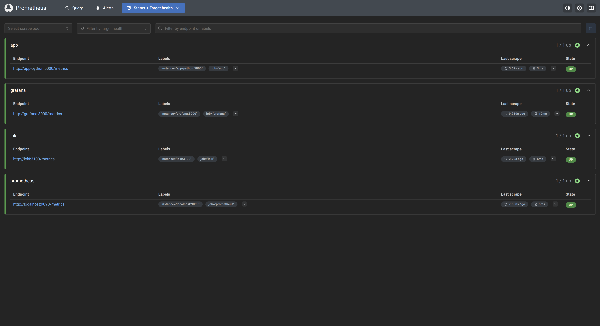
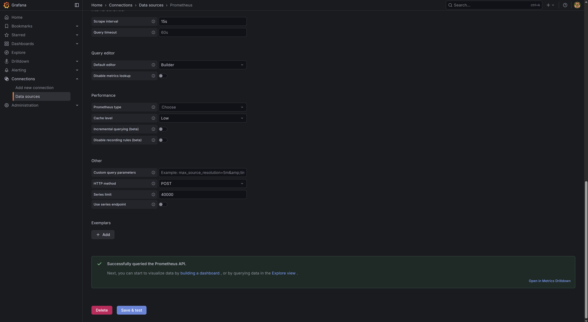
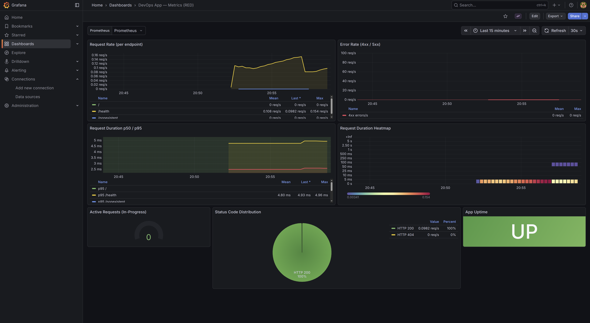

# Lab 08 — Metrics & Monitoring with Prometheus

## 1. Architecture

```
┌─────────────────────────────────────────────────────────────────────┐
│                         Docker Network: logging                     │
│                                                                     │
│  ┌────────────────┐   /metrics    ┌────────────────────┐            │
│  │   app-python   │◄──────────────│    Prometheus      │            │
│  │  (FastAPI)     │               │   (prom/prometheus │            │
│  │  :5000         │               │    v3.9.0)  :9090  │            │
│  └────────────────┘               └────────┬───────────┘            │
│                                            │  scrape                │
│  ┌────────────────┐   /metrics             │                        │
│  │     Loki       │◄───────────────────────┤                        │
│  │   :3100        │                        │                        │
│  └────────────────┘                        │                        │
│                                            │                        │
│  ┌────────────────┐   /metrics             │                        │
│  │    Grafana     │◄───────────────────────┤                        │
│  │   :3000        │                        │                        │
│  └───────┬────────┘                        │                        │
│          │  data source query              │                        │
│          └────────────────────────────────►┘                        │
│                  Prometheus datasource (PromQL)                     │
└─────────────────────────────────────────────────────────────────────┘

Metric flow: App → exposes /metrics → Prometheus scrapes → Grafana queries
Log flow:    App → stdout JSON → Promtail → Loki → Grafana queries
```

---

## 2. Application Instrumentation

### Metrics defined in `app_python/app.py`

#### HTTP metrics (RED method)

| Metric | Type | Labels | Purpose |
|---|---|---|---|
| `http_requests_total` | Counter | `method`, `endpoint`, `status` | Rate — total requests received |
| `http_request_duration_seconds` | Histogram | `method`, `endpoint` | Duration — latency distribution |
| `http_requests_in_progress` | Gauge | — | Concurrency — requests in-flight |

#### Application-specific metrics

| Metric | Type | Labels | Purpose |
|---|---|---|---|
| `devops_info_endpoint_calls_total` | Counter | `endpoint` | Tracks calls to named business endpoints (`/`, `/health`) |
| `devops_info_system_collection_seconds` | Histogram | — | Measures time spent collecting `platform`/`socket` system info |

### Why these metrics?

The three HTTP metrics directly implement the **RED Method** (Rate, Errors, Duration) which is the standard for request-driven services:
- **Rate** — `rate(http_requests_total[5m])` tells us current throughput.
- **Errors** — filtering `status=~"5.."` isolates server-side failures.
- **Duration** — histogram percentiles (`histogram_quantile(0.95, ...)`) reveal tail latency without losing the distribution.

The application metrics add business context:
- `devops_info_endpoint_calls_total` shows which endpoints are actually used vs just health-checked.
- `devops_info_system_collection_seconds` tracks potential slow OS calls that could degrade response time.

### Implementation approach

The HTTP middleware (`log_and_instrument_requests`) is the single instrumentation point:

```python
http_requests_in_progress.inc()
try:
    response = await call_next(request)
finally:
    http_requests_in_progress.dec()

http_requests_total.labels(method=..., endpoint=path, status=str(response.status_code)).inc()
http_request_duration_seconds.labels(method=..., endpoint=path).observe(duration)
```

The `/metrics` path is excluded from the middleware to prevent self-tracking noise. The `system_info_collection_seconds` histogram uses the `with metric.time():` context manager around `get_system_info()`.

---

## 3. Prometheus Configuration

**File:** `monitoring/prometheus/prometheus.yml`

```yaml
global:
  scrape_interval: 15s
  evaluation_interval: 15s
  external_labels:
    environment: "lab08"

scrape_configs:
  - job_name: "prometheus"
    static_configs:
      - targets: ["localhost:9090"]

  - job_name: "app"
    static_configs:
      - targets: ["app-python:5000"]
    metrics_path: "/metrics"

  - job_name: "loki"
    static_configs:
      - targets: ["loki:3100"]
    metrics_path: "/metrics"

  - job_name: "grafana"
    static_configs:
      - targets: ["grafana:3000"]
    metrics_path: "/metrics"
```

### Scrape targets

| Job | Target | Port | Notes |
|---|---|---|---|
| `prometheus` | `localhost:9090` | 9090 | Prometheus self-scrape |
| `app` | `app-python:5000` | 5000 | FastAPI app (container-internal port) |
| `loki` | `loki:3100` | 3100 | Loki internal metrics |
| `grafana` | `grafana:3000` | 3000 | Grafana server metrics |

### Retention

Prometheus is started with:
```
--storage.tsdb.retention.time=15d
--storage.tsdb.retention.size=10GB
```

15 days of metrics data at up to 10 GB. This prevents unbounded disk growth while keeping enough history for trend analysis.

---

## 4. Dashboard Walkthrough

Dashboard: **DevOps App — Metrics (RED)** (`app-metrics.json`)

Auto-provisioned at startup via `grafana/provisioning/dashboards/`.

### Panel 1 — Request Rate (per endpoint)

```promql
sum(rate(http_requests_total[5m])) by (endpoint)
```

Time-series graph. Shows requests/second for each endpoint (`/`, `/health`, etc.) over the selected time range. Answers the **R** of RED. Useful for capacity planning and spotting traffic spikes.

### Panel 2 — Error Rate (4xx / 5xx)

```promql
sum(rate(http_requests_total{status=~"5.."}[5m]))
sum(rate(http_requests_total{status=~"4.."}[5m]))
```

Time-series with red threshold line at 0.01 req/s. Answers the **E** of RED. Thresholds make alert-worthy conditions immediately visible.

### Panel 3 — Request Duration p50 / p95

```promql
histogram_quantile(0.95, sum(rate(http_request_duration_seconds_bucket[5m])) by (le, endpoint))
histogram_quantile(0.50, sum(rate(http_request_duration_seconds_bucket[5m])) by (le, endpoint))
```

Time-series graph. Answers the **D** of RED. p95 reveals tail latency that averages hide; comparing p50 vs p95 shows how consistent performance is.

### Panel 4 — Request Duration Heatmap

```promql
sum(rate(http_request_duration_seconds_bucket[5m])) by (le)
```

Heatmap visualization with log-scale Y axis. Shows the full latency distribution over time — hot spots indicate when and how long slowdowns occur.

### Panel 5 — Active Requests (In-Progress)

```promql
http_requests_in_progress
```

Gauge panel with thresholds at 5 (yellow) and 20 (red). Shows concurrency at any moment. High values indicate the service is saturated or upstream dependencies are slow.

### Panel 6 — Status Code Distribution

```promql
sum by (status) (rate(http_requests_total[5m]))
```

Pie chart. Provides at-a-glance proportion of 2xx/4xx/5xx traffic. Good for quick health assessment without reading time-series.

### Panel 7 — App Uptime

```promql
up{job="app"}
```

Stat panel. Maps `1` → green "UP" and `0` → red "DOWN". Immediately shows if Prometheus can reach the app's `/metrics` endpoint.

---

## 5. PromQL Examples

### 5.1 Current request rate across all endpoints

```promql
sum(rate(http_requests_total[5m]))
```

Total requests per second averaged over the last 5 minutes. The `rate()` function handles counter resets (e.g. after a restart).

### 5.2 Error rate as a percentage of total traffic

```promql
100 * sum(rate(http_requests_total{status=~"5.."}[5m]))
      /
      sum(rate(http_requests_total[5m]))
```

Returns a value 0–100. This is the most important SLO metric — e.g., "error rate < 0.1% for 99.9% uptime".

### 5.3 95th-percentile latency per endpoint

```promql
histogram_quantile(
  0.95,
  sum(rate(http_request_duration_seconds_bucket[5m])) by (le, endpoint)
)
```

Returns the latency value that 95% of requests complete within, broken down per endpoint. Use this to set latency SLOs.

### 5.4 Services currently DOWN

```promql
up == 0
```

Returns all scrape targets where Prometheus could not reach the `/metrics` endpoint. Useful as an alert condition.

### 5.5 Average system info collection time

```promql
rate(devops_info_system_collection_seconds_sum[5m])
/
rate(devops_info_system_collection_seconds_count[5m])
```

Dividing the sum by the count gives the rolling average duration of `get_system_info()`. Spikes here indicate OS-level slowness affecting response time.

### 5.6 Endpoint call breakdown

```promql
sum by (endpoint) (rate(devops_info_endpoint_calls_total[5m]))
```

Shows which application endpoints are most-called, independent of HTTP method or status. Useful to distinguish business traffic from health-check noise.

---

## 6. Production Setup

### Health checks

Every service has a health check configured:

| Service | Check command | Interval | Retries |
|---|---|---|---|
| `loki` | `wget .../ready` | 10s | 5 |
| `grafana` | `wget .../api/health` | 10s | 5 |
| `app-python` | `urllib.request.urlopen .../health` | 10s | 3 |
| `prometheus` | `wget .../-/healthy` | 10s | 5 |

`promtail` is a stateless log-shipper; it does not expose a stable health endpoint in this version.

### Resource limits

| Service | CPU limit | Memory limit | CPU reservation | Memory reservation |
|---|---|---|---|---|
| `loki` | 1.0 | 1 G | 0.25 | 256 M |
| `promtail` | 0.5 | 256 M | 0.1 | 64 M |
| `grafana` | 1.0 | 512 M | 0.25 | 128 M |
| `app-python` | 0.5 | 256 M | 0.1 | 64 M |
| `prometheus` | 1.0 | 1 G | 0.25 | 256 M |

### Data retention

**Prometheus:** 15 days / 10 GB (whichever is reached first), configured via CLI flags:
```
--storage.tsdb.retention.time=15d
--storage.tsdb.retention.size=10GB
```

**Loki:** 7-day retention configured in `loki/config.yml` (from Lab 7).

**Grafana:** Dashboards and data-source config are provisioned from files, so the `grafana-data` volume only needs to persist user-created content.

### Persistent volumes

```yaml
volumes:
  loki-data:       # Loki TSDB chunks
  grafana-data:    # Grafana SQLite DB, plugins, user dashboards
  prometheus-data: # Prometheus TSDB blocks
```

All three are named Docker volumes. They survive `docker compose down` and are only removed with `docker compose down -v`.

**Persistence test:**
1. Start stack: `docker compose up -d`
2. Make a few requests to generate metrics
3. Stop: `docker compose down`
4. Restart: `docker compose up -d`
5. Open Grafana → previously imported dashboards and data are present; Prometheus has historical data points from before the restart.

---

## 7. Testing Results

### Stack health — `docker compose ps`

All 5 services confirmed healthy after deployment:

```
NAME                IMAGE                       STATUS
devops-app-python   devops-info-service:local   Up (healthy)   0.0.0.0:8000->5000/tcp
grafana             grafana/grafana:12.3.1      Up (healthy)   0.0.0.0:3000->3000/tcp
loki                grafana/loki:3.0.0          Up (healthy)   0.0.0.0:3100->3100/tcp
prometheus          prom/prometheus:v3.9.0      Up (healthy)   0.0.0.0:9090->9090/tcp
promtail            grafana/promtail:3.0.0      Up             0.0.0.0:9080->9080/tcp
```

### Prometheus targets — all UP

Verified via `GET /api/v1/targets`:

```
Job: app              State: up    URL: http://app-python:5000/metrics
Job: grafana          State: up    URL: http://grafana:3000/metrics
Job: loki             State: up    URL: http://loki:3100/metrics
Job: prometheus       State: up    URL: http://localhost:9090/metrics
```



### Live PromQL query results

**`up`** — all targets reachable:
```
job=loki             up=1
job=grafana          up=1
job=prometheus       up=1
job=app              up=1
```

**`http_requests_total`** — after sending 50x `/`, 20x `/health`, 1x `/nonexistent`:
```
endpoint=/        method=GET  status=200  => 50
endpoint=/health  method=GET  status=200  => 27
endpoint=/other   method=GET  status=404  => 1
```

**`sum(rate(http_requests_total[5m])) by (endpoint)`**:
```
endpoint=/health     rate=0.0951 req/s
endpoint=/           rate=0.0000 req/s   (burst finished, window cooling)
```

![PromQL — rate(http_requests_total[5m]) graph](image/LAB08/1773943046707.png)

### `/metrics` endpoint output (excerpt)

```
# HELP http_requests_total Total number of HTTP requests
# TYPE http_requests_total counter
http_requests_total{endpoint="/health",method="GET",status="200"} 23.0
http_requests_total{endpoint="/",method="GET",status="200"} 50.0
http_requests_total{endpoint="/nonexistent",method="GET",status="404"} 1.0

# HELP http_request_duration_seconds HTTP request duration in seconds
# TYPE http_request_duration_seconds histogram
http_request_duration_seconds_bucket{endpoint="/",le="0.005",method="GET"} 50.0
http_request_duration_seconds_count{endpoint="/",method="GET"} 50.0
http_request_duration_seconds_sum{endpoint="/",method="GET"} 0.039

# HELP http_requests_in_progress Number of HTTP requests currently being processed
# TYPE http_requests_in_progress gauge
http_requests_in_progress 0.0

# HELP devops_info_endpoint_calls_total Total calls per named endpoint
# TYPE devops_info_endpoint_calls_total counter
devops_info_endpoint_calls_total{endpoint="/health"} 23.0
devops_info_endpoint_calls_total{endpoint="/"} 50.0

# HELP devops_info_system_collection_seconds Time spent collecting system information
# TYPE devops_info_system_collection_seconds histogram
devops_info_system_collection_seconds_bucket{le="0.0001"} 49.0
devops_info_system_collection_seconds_count 50.0
devops_info_system_collection_seconds_sum 0.00276
```

### Grafana — Prometheus datasource connected



### Grafana — Application metrics dashboard (7 panels live)



### Data persistence test

Ran `docker compose down && docker compose up -d`. After restart:
- All 5 services healthy within 60 s
- Prometheus TSDB retained historical counters (`/` = 50, `/health` = 27, `/nonexistent` = 1)
- Grafana dashboards (provisioned from files) immediately available

---

## 8. Challenges & Solutions

### Challenge 1 — FastAPI middleware vs Flask hooks

**Problem:** The lab examples show Flask's `@app.before_request` / `@app.after_request` hooks. FastAPI uses async ASGI middleware with a different pattern.

**Solution:** Used FastAPI's `@app.middleware("http")` decorator. The middleware wraps `call_next` with a `try/finally` block so the gauge always decrements even if an exception is raised.

### Challenge 2 — Metrics self-tracking noise

**Problem:** Including `/metrics` itself in `http_requests_total` would create a high-frequency time series driven entirely by Prometheus scrape intervals (every 15 s), polluting rate and latency graphs.

**Solution:** Added an early-return guard at the top of the middleware:
```python
if path == "/metrics":
    return await call_next(request)
```

### Challenge 3 — Container hostname resolution

**Problem:** In `prometheus.yml`, the app's target must use the Docker Compose service name (`app-python`) and the *container-internal* port (`5000`), not the host-mapped port (`8000`).

**Solution:** Used `targets: ["app-python:5000"]`. Docker's embedded DNS resolves service names within the same network. The host port `8000` is only for external access.

### Challenge 4 — Duplicate Prometheus registry on app startup

**Problem:** App exited immediately with `ValueError: Duplicated timeseries in CollectorRegistry`. Metrics defined at module level were being registered twice.

**Root cause:** `uvicorn.run("app:app", ...)` with a string argument causes Python to import `app.py` twice — once as `__main__` (when the script is executed directly) and once as the `app` module (by uvicorn). Prometheus metrics are registered on import, so the second import tried to register the same metric names again.

**Fix:** Changed to `uvicorn.run(app, ...)` — passing the already-loaded FastAPI object directly prevents the second import.

### Challenge 5 — Grafana dashboard provisioning with datasource variable

**Problem:** The provisioned dashboard JSON must reference the Prometheus datasource in a way that survives import into any Grafana instance (including ones where the datasource UID differs).

**Solution:** Used a `datasource` template variable (`${DS_PROMETHEUS}`) of type `datasource` in the dashboard JSON. Grafana auto-populates it with the first available Prometheus datasource on load.

---

## Metrics vs Logs — When to Use Each

| Question | Use | Tool |
|---|---|---|
| "Is the service up right now?" | Metric (`up`) | Prometheus |
| "What was the error rate over the last hour?" | Metric | Prometheus/Grafana |
| "Which specific request caused a 500 at 14:32?" | Log | Loki/Grafana |
| "What were the SQL queries that were slow yesterday?" | Log | Loki |
| "What is the p99 latency for `/` this week?" | Metric | Prometheus |
| "What did the stack trace look like for this crash?" | Log | Loki |

**Rule of thumb:** Metrics answer *how much* and *how fast*; logs answer *what exactly happened*. Both together provide complete observability — the same Grafana instance queries both Loki (logs) and Prometheus (metrics), enabling correlation.
